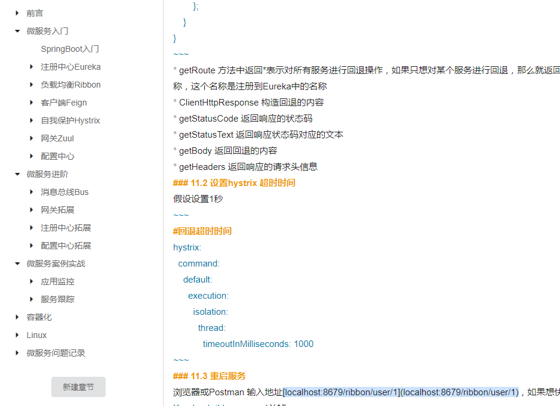

 ### 本项目整理了SpringCloud从入门到实战的全部过程，并附完整代码和实例,，目前已完成过半
 
 ### 项目地址
 #### GitHub
 https://github.com/xuyisu/fw-sping-cloud
 #### Gitee
 https://gitee.com/gitxys/fw-sping-cloud
 
 ### 部分内容
 
 
 #### 官方教程
 [教程地址](https://www.kancloud.cn/xuyisu/springcloud_springboot)
 
 小程序
 
 
 
 ### 项目中所用的技术栈
 |  技术栈   |  版本 |
 | --- | --- |
 |  jdk |   1.8.0_161  |
 |  SpringBoot   | 2.2.1.RELEASE   |
 |  SpringCloud   | Hoxton.RELEASE   |
 |  SpringCloud Alibaba   | 0.9.0.RELEASE   |
 |  Hutool   | 5.0.6   |
 
#### 模块说明
```lua
fw-spring-cloud  -- https://github.com/xuyisu/fw-sping-cloud.git

fw-spring-cloud
└── fw-cloud-client -- 应用健康 
└── fw-cloud-client -- 客户端 
└── fw-cloud-config-center -- 配置中心 
└── fw-cloud-feign -- elk例子 
└── fw-cloud-feign -- REST请求 
└── fw-cloud-gateways -- 网关
└── fw-cloud-hystrix- 断路器
└── fw-cloud-mq -- RabbitMQ、Kafka 例子
└── fw-cloud-register -- 注册中心
└── fw-cloud-ribbon -- 负载均衡
└── fw-cloud-springboot -- springboot
└── fw-cloud-stream -- stream
└── fw-cloud-tracking -- 链路跟踪
└── fw-cloud-upload -- 文件上传
 	 
```


### 交流群
>里面上传了很多架构、技术文档、共同进步


