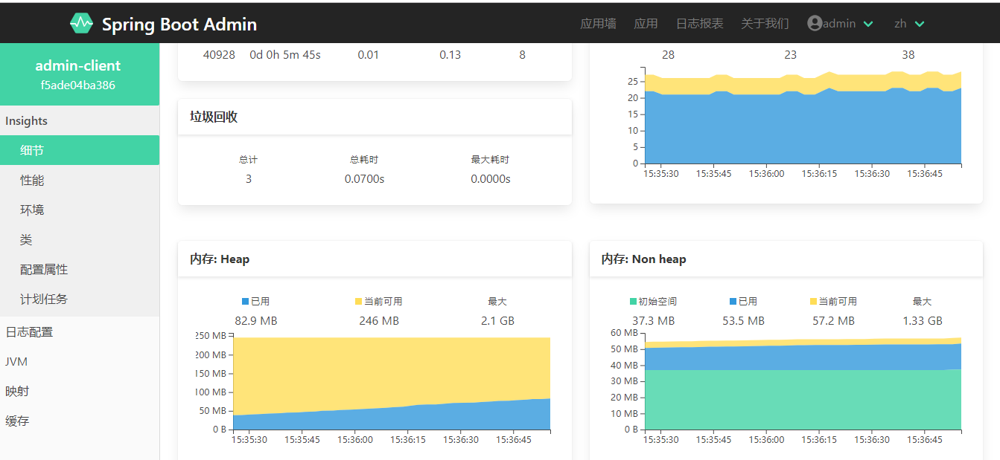
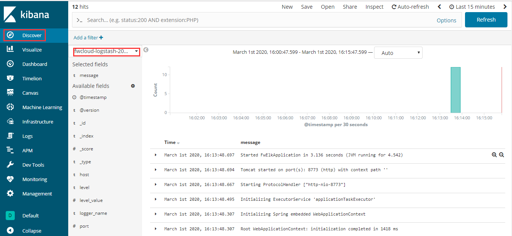
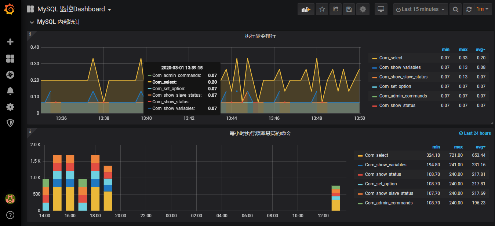

### 本项目整理了SpringCloud从入门到实战的全部过程，并附完整代码和实例
# 项目地址
>欢迎star和fork,支持一下作者，让更多人发现
#### GitHub
[https://github.com/xuyisu/fw-sping-cloud](https://github.com/xuyisu/fw-sping-cloud)
#### Gitee
[https://gitee.com/gitxys/fw-sping-cloud](https://gitee.com/gitxys/fw-sping-cloud)
 
### 项目中所用的技术栈
|  技术栈   |  版本 |
| --- | --- |
|  jdk |   1.8.0_161  |
|  SpringBoot   | 2.2.1.RELEASE   |
|  SpringCloud   | Hoxton.RELEASE   |
|  SpringCloud Alibaba   | 2.1.1.RELEASE   |
|  Hutool   | 5.0.6   |
 
### 涉及知识点
|   阶段  |  知识点   | 状态   |
| --- | --- |--- |
| 入门    |   SpringBoot  |   OK  |
| 入门    |   Eureka|   OK  |
| 入门    |   RIbbon|   OK  |
| 入门    |   Feign|   OK  |
| 入门    |   Hystrix|   OK  |
| 入门    |   Zuul|   OK  |
| 入门    |   Config|   OK  |
| 进阶    |   总线|   OK  |
| 进阶    |   Gateway|   OK |
| 进阶    |   服务跟踪（SkyWalking）|   OK  |
| 进阶    |   服务跟踪（Zipkin）|   OK  |
| 进阶    |   注册中心拓展（Zookeeper）|   OK |
| 进阶    |   注册中心拓展（Nacos）|   OK |
| 进阶    |   注册中心拓展（Consul）|  OK |
| 进阶    |  网关拓展（Zuul 服务现流）|   OK  |
| 进阶    |  网关拓展（Spring Cloud Gateway）|   OK  |
| 进阶    |   配置中心拓展（Nacos）|  OK |
| 进阶    |   配置中心拓展（Apollo）|  OK |
| 高级    |   应用监控（SpringBoot Admin）|   OK  |
| 高级    |   应用监控（ELK）|   OK  |
| 高级    |   应用监控（Prometheus ）|  OK  |
| 高级    |   缓存(Guava、Redis) |   OK  |
| 高级    |   分布式锁(Mysql、Redis、Zookeeper) |   OK  |
| 高级    | 分库分表(Sharding-JDBC)  |  OK  |
| 高级    | 分布式事务(MQ)  |  OK  |
| 高级    | 分布式事务(LCN)  |  OK  |
| 高级    | 分布式事务(Seata)  |  OK  |
| 安全认证 |   Spring Security |   进行中  |
| 容器化   |   docker |   OK  |
| 容器化   |   k8s|   进行中  |

 
### 官方教程
 >很多代码之前是有交互和修改的，具体请参考教程使用，当然如果你已经精通Spring Cloud ，阅读这些案例也会帮你回顾和加深印象。
 [教程地址](https://www.kancloud.cn/xuyisu/springcloud_springboot)

 
### 部分内容截图
#### admin 监控

#### elk 日志

#### Prometheus  监控

### 交流群(QQ群779183850)
>里面上传了很多架构、技术文档、共同进步

