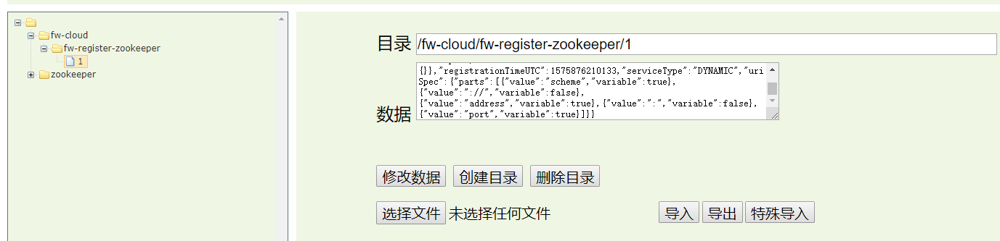

 ### zookeeper
 
 ### SpringCloud 连 ZK 坑比较多,百度、google 出来的很多都是不对的
 
 1.如果使用官方的依赖包,每次启动不管zk地址修改成了什么,启动依然会找127.0.0.1:2181,这是一个bug
 ```pom
 <dependency>
     <groupId>org.springframework.cloud</groupId>
     <artifactId>spring-cloud-starter-zookeeper-all</artifactId>
     <exclusions>
         <exclusion>
             <groupId>org.apache.zookeeper</groupId>
             <artifactId>zookeeper</artifactId>
         </exclusion>
     </exclusions>
 </dependency>
 <dependency>
     <groupId>org.apache.zookeeper</groupId>
     <artifactId>zookeeper</artifactId>
     <version>3.4.12</version>
     <exclusions>
         <exclusion>
             <groupId>org.slf4j</groupId>
             <artifactId>slf4j-log4j12</artifactId>
         </exclusion>
     </exclusions>
 </dependency>
 ```
2.那么只能自己去引包了,zk包我们自己引和自己服务端部署的版本一致的(不一致可能也会有问题)
```pom
<dependencies>
        <dependency>
            <groupId>org.springframework.boot</groupId>
            <artifactId>spring-boot-starter-web</artifactId>
        </dependency>
        <dependency>
            <groupId>org.springframework.cloud</groupId>
            <artifactId>spring-cloud-starter-zookeeper-discovery</artifactId>
        </dependency>
        <dependency>
            <groupId>org.apache.zookeeper</groupId>
            <artifactId>zookeeper</artifactId>
            <version>${zookeeper.version}</version>
            <exclusions>
                <exclusion>
                    <groupId>org.slf4j</groupId>
                    <artifactId>slf4j-log4j12</artifactId>
                </exclusion>
            </exclusions>
        </dependency>
    </dependencies>
```
3.启动之后还会出现如下问题
   >什么原因呢？
   - 缺包
```java
Caused by: java.lang.ClassNotFoundException: org.codehaus.jackson.Versioned
	at java.net.URLClassLoader.findClass(URLClassLoader.java:381)
	at java.lang.ClassLoader.loadClass(ClassLoader.java:424)
	at sun.misc.Launcher$AppClassLoader.loadClass(Launcher.java:331)
	at java.lang.ClassLoader.loadClass(ClassLoader.java:357)
	... 99 common frames omitted
```
需要再引入
```pom
        <dependency>
            <groupId>org.codehaus.jackson</groupId>
            <artifactId>jackson-core-asl</artifactId>
            <version>${ackson-core-asl.version}</version>
        </dependency>
```
4.OK SpringCloud-Zookeeper Server端好了

```text
2019-12-09 15:42:27 INFO  main-EventThread org.apache.curator.framework.state.ConnectionStateManager State change: CONNECTED
2019-12-09 15:42:27 INFO  main-EventThread org.apache.curator.framework.imps.EnsembleTracker New config event received: {}
2019-12-09 15:42:27 INFO  main-EventThread org.apache.curator.framework.imps.EnsembleTracker New config event received: {}
2019-12-09 15:42:27 WARN  main org.springframework.cloud.loadbalancer.config.BlockingLoadBalancerClientAutoConfiguration$BlockingLoadBalancerClientRibbonWarnLogger You already have RibbonLoadBalancerClient on your classpath. It will be used by default. As Spring Cloud Ribbon is in maintenance mode. We recommend switching to BlockingLoadBalancerClient instead. In order to use it, set the value of `spring.cloud.loadbalancer.ribbon.enabled` to `false` or remove spring-cloud-starter-netflix-ribbon from your project.
2019-12-09 15:42:27 WARN  main org.springframework.cloud.loadbalancer.config.LoadBalancerCacheAutoConfiguration$LoadBalancerCaffeineWarnLogger Spring Cloud LoadBalancer is currently working with default default cache. You can switch to using Caffeine cache, by adding it to the classpath.
2019-12-09 15:42:27 INFO  main org.apache.coyote.http11.Http11NioProtocol Starting ProtocolHandler ["http-nio-8661"]
2019-12-09 15:42:27 INFO  main org.springframework.boot.web.embedded.tomcat.TomcatWebServer Tomcat started on port(s): 8661 (http) with context path ''
2019-12-09 15:42:27 INFO  main com.yisu.register.zookeeper.FwRegisterZookeeperApplication Started FwRegisterZookeeperApplication in 3.963 seconds (JVM running for 5.012)
```


```json
{"name":"fw-register-zookeeper","id":"1","address":"*******","port":8661,"sslPort":null,"payload":{"@class":"org.springframework.cloud.zookeeper.discovery.ZookeeperInstance","id":"application-1","name":"fw-register-zookeeper","metadata":{}},"registrationTimeUTC":1575876210133,"serviceType":"DYNAMIC","uriSpec":{"parts":[{"value":"scheme","variable":true},{"value":"://","variable":false},{"value":"address","variable":true},{"value":":","variable":false},{"value":"port","variable":true}]}}
```
